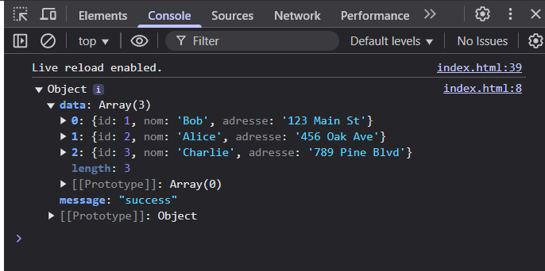
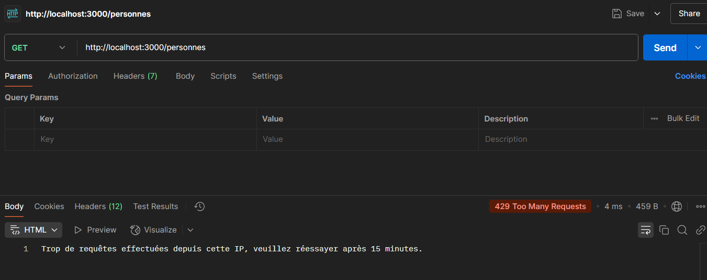

# 📚 TP : API RESTful avec CORS et Rate Limiting
## 🎯 Objectifs
- Mettre en place la gestion des CORS pour autoriser les requêtes multi-origines. 🌐

- Sécuriser l'API avec un mécanisme de Rate Limiting (limitation du nombre de requêtes). ⏳

## 🛠️ Outils Utilisés
*Node.js* : Environnement d'exécution JavaScript. 🟢

*Express.js* : Framework pour créer l'API. 🚀

*SQLite3* : Base de données légère et embarquée. 🗄️

*CORS* : Middleware pour gérer les requêtes multi-origines. 🔄

*express-rate-limit* : Middleware pour limiter le nombre de requêtes par IP. 🛑
## 📝 Étapes du TP
### 1. 📥 Installation des Dépendances
Installez les modules nécessaires pour le projet :
```bash
npm install express sqlite3 cors express-rate-limit
```
### 2. 📝 Configuration de l'API
Le fichier index.js contient la configuration de l'API, y compris :

*CORS* : Autorise les requêtes multi-origines. 🌐

*Rate Limiting* : Limite le nombre de requêtes à 100 par IP toutes les 15 minutes. ⏳

Extrait du Code
```javascript
const express = require('express');
const cors = require('cors');
const rateLimit = require('express-rate-limit');
const db = require('./database');
const app = express();
const PORT = 3000;

// Middleware pour parser le JSON
app.use(express.json());

// Configuration CORS
app.use(cors());

// Configuration du Rate Limiting
const limiter = rateLimit({
    windowMs: 15 * 60 * 1000, // 15 minutes
    max: 100, // Limite chaque IP à 100 requêtes par fenêtre
    message: 'Trop de requêtes effectuées depuis cette IP, veuillez réessayer après 15 minutes.'
});
app.use(limiter);

// Routes de l'API
app.get('/', (req, res) => {
    res.json("Registre de personnes! Choisissez le bon routage!");
});

// Récupérer toutes les personnes
app.get('/personnes', (req, res) => {
    db.all("SELECT * FROM personnes", [], (err, rows) => {
        if (err) {
            res.status(400).json({ "error": err.message });
            return;
        }
        res.json({ "message": "success", "data": rows });
    });
});

// Démarrer le serveur
app.listen(PORT, () => {
    console.log(`Server running on port ${PORT}`);
}); 
```
### 3. 🧪 Tester l'API
*Tester CORS*
Créez un fichier HTML pour effectuer une requête vers l'API :
```html
<!DOCTYPE html>
<html>
<body>
    <h1>Test CORS</h1>
    <script>
        fetch('http://localhost:3000/personnes')
            .then(response => response.json())
            .then(data => console.log(data))
            .catch(error => console.error(error));
    </script>
</body>
</html>
```
Ouvrez ce fichier dans un navigateur et vérifiez que les données sont bien récupérées. ✅



*Capture d'écran de la console montrant le démarrage du serveur.*


*Tester Rate Limiting*
1- Utilisez Postman pour envoyer plus de 100 requêtes en moins de 15 minutes. 🚀

2- Après avoir atteint la limite, vous recevrez le message suivant :

```json
{
    "message": "Trop de requêtes effectuées depuis cette IP, veuillez réessayer après 15 minutes."
}
```



*Capture d'écran de Postman montrant la réponse après avoir dépassé la limite de requêtes.*

## 📂 Structure du Projet

TP2.5/
├── node_modules/          # Dossier des dépendances 📦
├── img/                   # Dossier contenant les images pour le README 🖼️
│   ├── imgconsole.png     # Capture d'écran de la console 🖥️
│   └── postman.png        # Capture d'écran de Postman 📨
├── database.js            # Configuration de la base de données SQLite 🗄️
├── index.js               # Fichier principal de l'API 🚀
├── package.json           # Fichier de configuration du projet 📄
├── README.md              # Documentation du projet 📖
├── maBaseDeDonnees.sqlite # Fichier de la base de données SQLite 🗃️
└── .gitignore             # Fichier pour ignorer certains fichiers/dossiers 🚫

## 🚀 Comment Exécuter le Projet
Clonez le dépôt ou téléchargez les fichiers. 📥

1- Installez les dépendances :

```bash
npm install 
```
2- Démarrez le serveur :
```bash
node index.js
```
3- Accédez à l'API via http://localhost:3000. 🌐