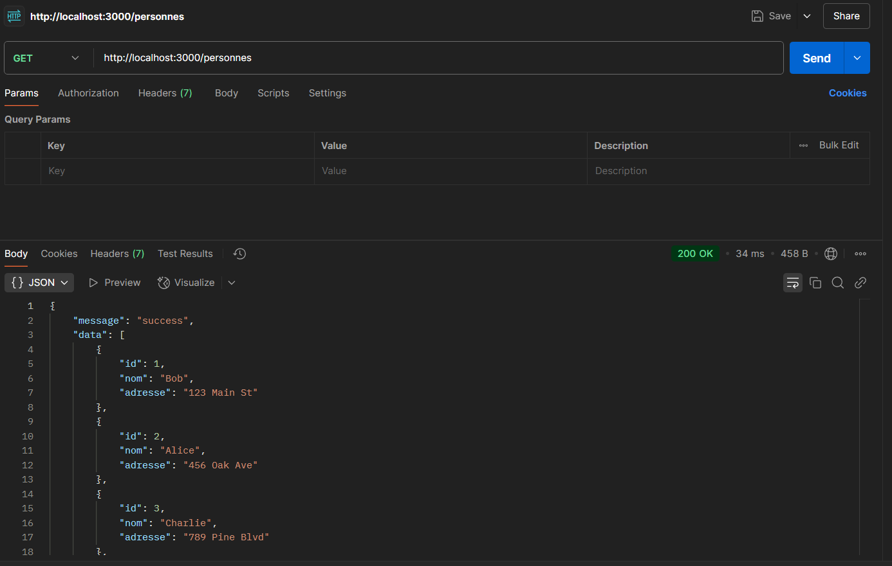
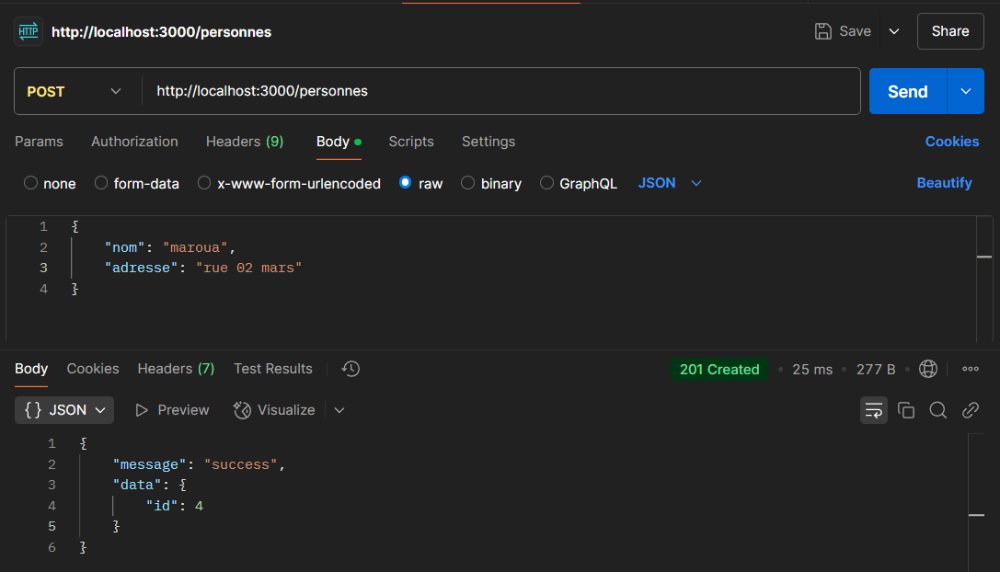
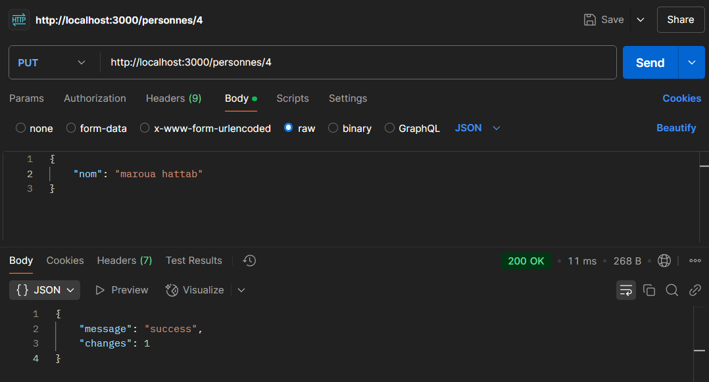
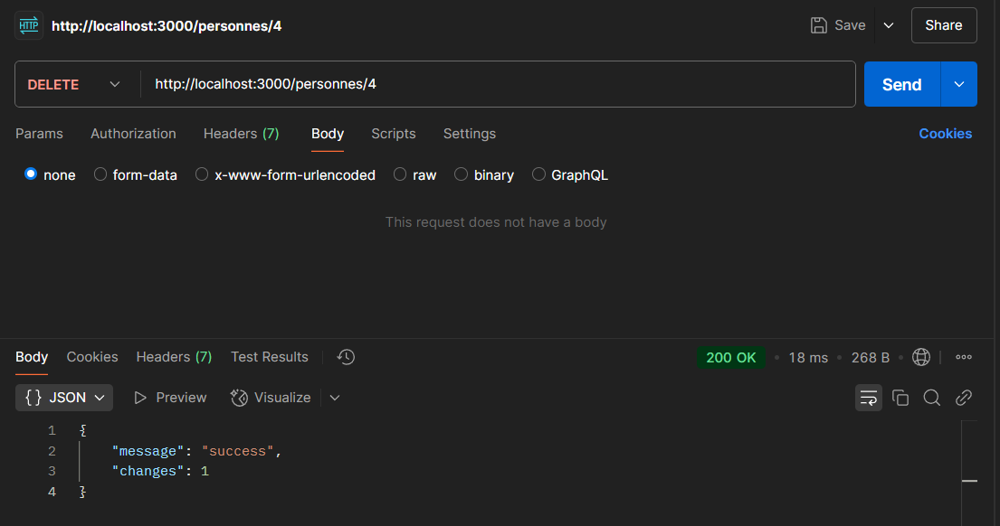
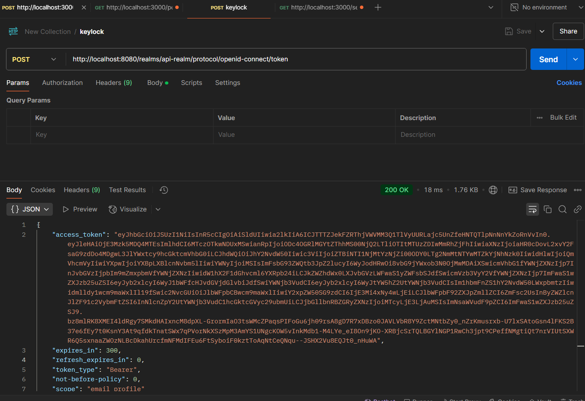
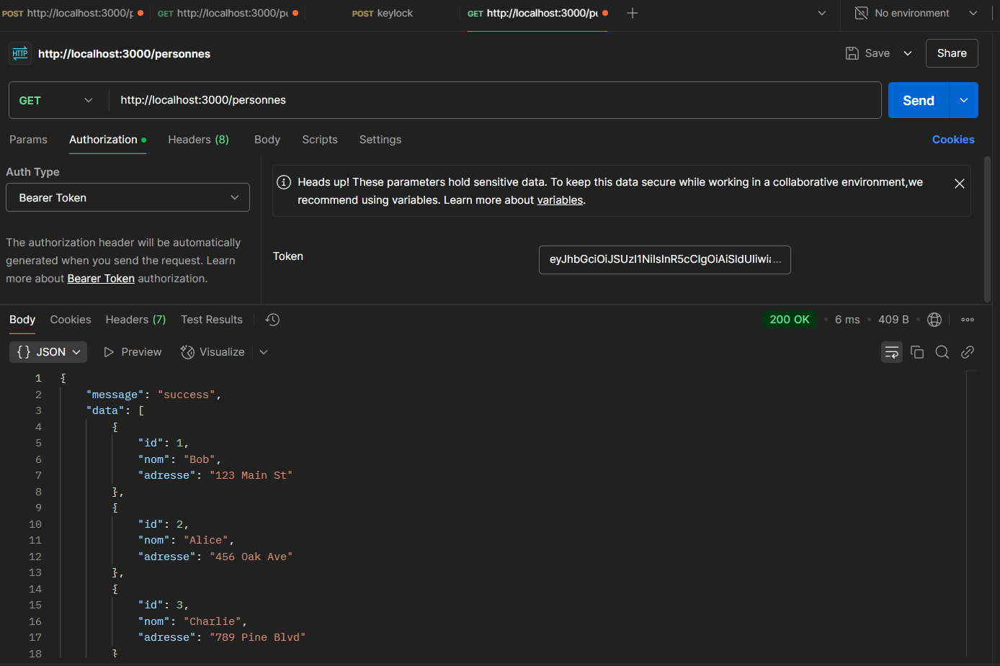
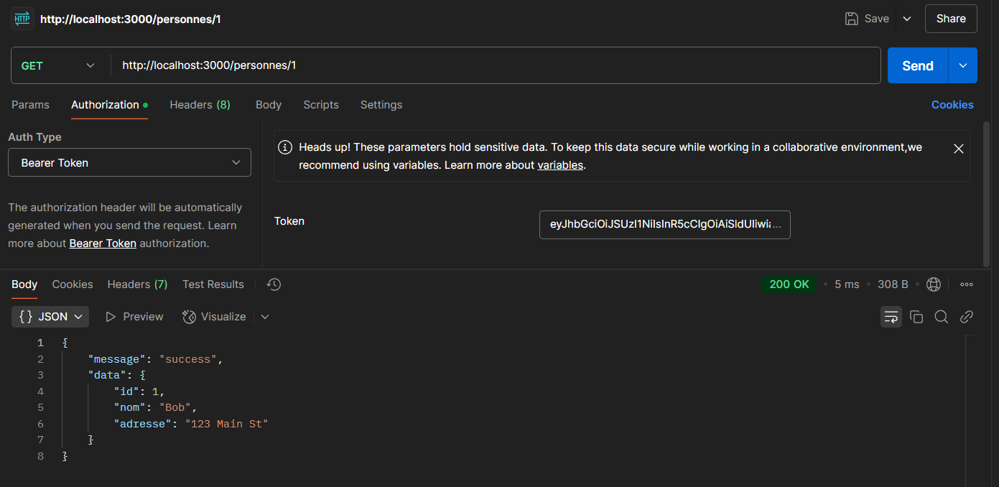
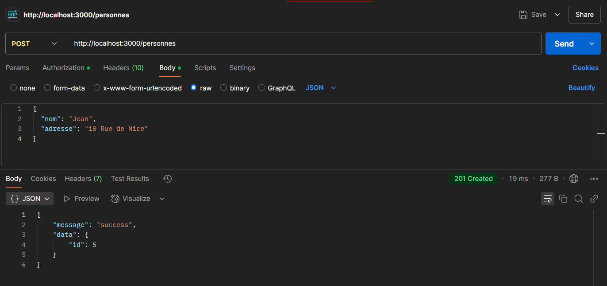

# 🔐 TP : Création d’une API Restful avec Express JS

## 📌 Objectif

- Création d’une API Rest avec Express JS
- Utilisation des bonnes pratiques pour les API Restful

## 🛠️ Outils Utilisés
kk
- **Node.js**
- **Express.js**
- **SQLite3**
- **Postman (pour tester l’API)**
- **Keycloak (pour la sécurisation des routes)**

## 🚀 Étapes de configuration

### 1️⃣ Initialisation du Projet

1. Créez un dossier pour votre projet et ouvrez un terminal dans ce dossier.
2. Initialisez un projet Node.js :
   ```bash
   npm init -y
   ```
3. Installez les dépendances nécessaires :
   ```bash
   npm install express sqlite3 keycloak-connect express-session
   ```

### 2️⃣ Configuration de SQLite3

```javascript
const sqlite3 = require('sqlite3').verbose();
const db = new sqlite3.Database('./maBaseDeDonnees.sqlite', sqlite3.OPEN_READWRITE | sqlite3.OPEN_CREATE, (err) => {
    if (err) console.error(err.message);
    else {
        console.log('✅ Connecté à la base de données SQLite.');
        db.run(`CREATE TABLE IF NOT EXISTS personnes (
            id INTEGER PRIMARY KEY AUTOINCREMENT,
            nom TEXT NOT NULL,
            adresse TEXT
        )`, (err) => {
            if (err) console.error(err.message);
        });
    }
});
module.exports = db;
```

### 3️⃣ Création de l'API avec Express.js

1. Créez un fichier `index.js`.
2. Ajoutez le code suivant pour gérer les routes :

```javascript
const express = require('express');
const db = require('./database');
const app = express();
app.use(express.json());
const PORT = 3000;

app.get('/', (req, res) => res.json("Registre de personnes! Choisissez le bon routage!"));

app.get('/personnes', (req, res) => {
    db.all("SELECT * FROM personnes", [], (err, rows) => {
        if (err) res.status(400).json({ "error": err.message });
        else res.json({ "message": "success", "data": rows });
    });
});

app.get('/personnes/:id', (req, res) => {
    db.get("SELECT * FROM personnes WHERE id = ?", [req.params.id], (err, row) => {
        if (err) res.status(400).json({ "error": err.message });
        else res.json({ "message": "success", "data": row });
    });
});

app.post('/personnes', (req, res) => {
    const { nom, adresse } = req.body;
    db.run(`INSERT INTO personnes (nom, adresse) VALUES (?, ?)`, [nom, adresse], function(err) {
        if (err) res.status(400).json({ "error": err.message });
        else res.json({ "message": "success", "data": { id: this.lastID } });
    });
});

app.put('/personnes/:id', (req, res) => {
    const { nom, adresse } = req.body;
    db.run(`UPDATE personnes SET nom = ?, adresse = ? WHERE id = ?`, [nom, adresse, req.params.id], function(err) {
        if (err) res.status(400).json({ "error": err.message });
        else res.json({ "message": "success" });
    });
});

app.delete('/personnes/:id', (req, res) => {
    db.run(`DELETE FROM personnes WHERE id = ?`, req.params.id, function(err) {
        if (err) res.status(400).json({ "error": err.message });
        else res.json({ "message": "success" });
    });
});

app.listen(PORT, () => console.log(`🚀 Serveur lancé sur le port ${PORT}`));
```

### 4️⃣ Test avec Postman

#### 📸 Captures d'écran :

- **GET /personnes** 
- **POST /personnes** 
- **PUT /personnes/{id}** 
- **DELETE /personnes/{id}** 

### 5️⃣ Sécurisation avec Keycloak

1. Lancez Keycloak avec la commande suivante :
   ```bash
   docker run -p 8080:8080 -e KEYCLOAK_ADMIN=admin -e KEYCLOAK_ADMIN_PASSWORD=admin -v keycloak_data:/opt/keycloak/data quay.io/keycloak/keycloak:latest start-dev
   ```
2. Accédez à l'URL [http://localhost:8080/](http://localhost:8080/) et connectez-vous avec les informations d'identification `admin/admin`.
3. Exportez le fichier `api-realm-export.json` :
   - Survolez le nom du royaume "Master".
   - Cliquez sur "Add realm" pour créer un nouveau royaume.
   - Une fois dans le royaume souhaité, cliquez sur "Export" pour exporter le fichier.

### 6️⃣ Obtenir un Jeton d'Accès et Accéder à une Route Sécurisée

#### Étape 1 : Obtenir un jeton d'accès

1. Dans Postman, créez une nouvelle requête.
2. Définissez le type de requête sur `POST`.
3. Définissez l'URL sur :
   ```
   http://localhost:8080/auth/realms/api-realm/protocol/openid-connect/token
   ```
4. Dans l'onglet "Body", sélectionnez "x-www-form-urlencoded".
5. Ajoutez les paires clé-valeur suivantes :
   - `grant_type : client_credentials`
   - `client_id : api-personne`
   - `client_secret : lmMqDHxDIwXzO6GITSQHs61z47w8r7JQ`
6. Envoyez la requête.

   

7. Dans la réponse, copiez la valeur du champ `access_token`.

#### Étape 2 : Accéder à la route sécurisée

1. Créez une nouvelle requête vers votre API (ex: `GET http://localhost:3000/personnes`).
2. Allez dans l'onglet "Authorization".
3. Sélectionnez "Bearer Token" comme type.
4. Collez le jeton d'accès que vous avez copié.
5. Envoyez la requête.

   
   
   

### 📂 Structure du Projet

```plaintext
TP2.5/
├── node_modules/          # Dépendances 📦
├── img/                   # Images pour le README 🖼️
├── database.js            # Base de données SQLite 🗄️
├── index.js               # API principale 🚀
├── keycloak-config.json   # Configuration de Keycloak 🔐
├── package.json           # Configuration du projet 📄
├── README.md              # Documentation 📖
└── maBaseDeDonnees.sqlite # Base de données 🗃️
```

---

## 🚀 Comment Exécuter le Projet

1. Installez les dépendances :
   ```bash
   npm install
   ```
2. Démarrez le serveur :
   ```bash
   node index.js
   ```
3. Accédez à l'API via `http://localhost:3000`. 🌐

