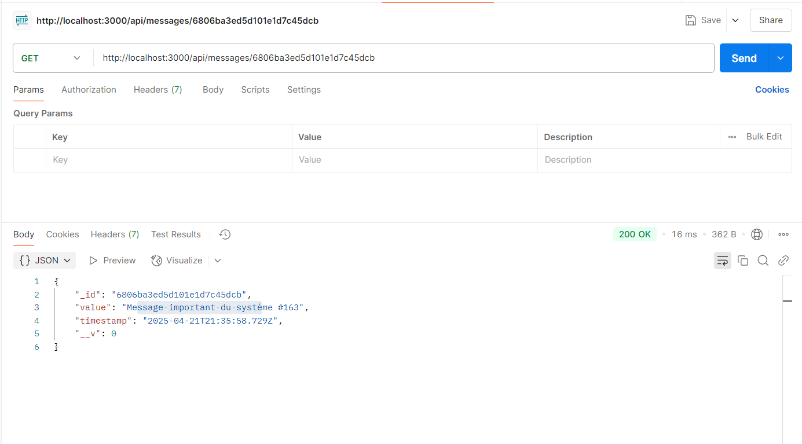
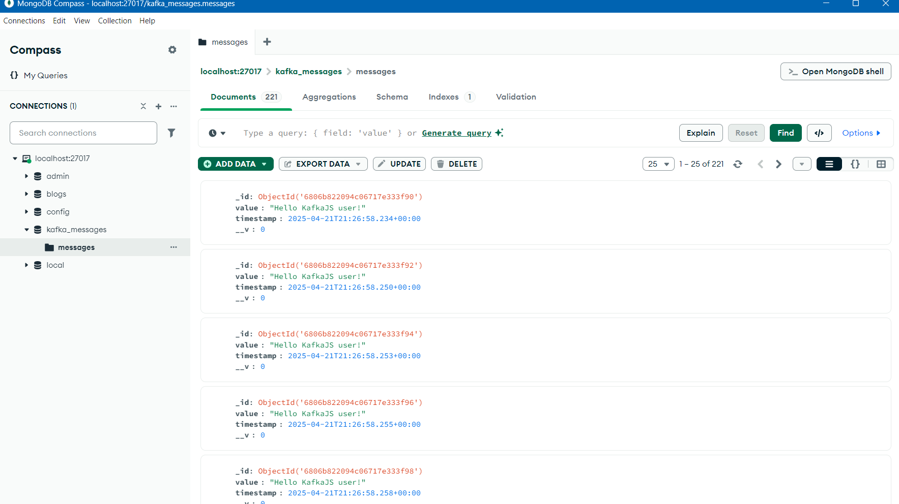

# 🚀 Kafka Node.js Integration Project

Ce projet démontre l'intégration d'Apache Kafka avec Node.js pour la gestion des flux de données, ainsi que le stockage dans MongoDB et l'exposition via une API REST. Cette solution complète permet de créer un pipeline de données en temps réel, depuis la production de messages jusqu'à leur consommation et leur visualisation via une API.

## 📋 Table des matières

- [Objectifs](#-objectifs)
- [Technologies utilisées](#-technologies-utilisées)
- [Architecture détaillée](#-architecture-détaillée)
- [Installation pas à pas](#-installation-pas-à-pas)
- [Configuration détaillée](#-configuration-détaillée)
- [Structure du projet](#-structure-du-projet)
- [Explication du code](#-explication-du-code)
- [Exécution du système](#-exécution-du-système)
- [API REST et endpoints](#-api-rest-et-endpoints)
- [Test des fonctionnalités](#-test-des-fonctionnalités)
- [Bonnes pratiques](#-bonnes-pratiques)
- [Extensions possibles](#-extensions-possibles)
- [Ressources](#-ressources)

## 🎯 Objectifs

Ce projet vise à atteindre les objectifs suivants :
- Comprendre les fondamentaux d'Apache Kafka et son utilisation avec Zookeeper
- Apprendre à créer et gérer des topics Kafka
- Développer un producteur Kafka en Node.js qui génère des messages
- Implémenter un consommateur Kafka en Node.js qui traite ces messages
- Intégrer MongoDB pour le stockage persistant des messages
- Créer une API REST avec Express.js pour exposer les messages stockés
- Mettre en place un système de traitement de données de bout en bout

## 💻 Technologies utilisées

### Principales technologies
- **Apache Kafka (3.9.0)** : Plateforme de streaming d'événements distribuée
- **Zookeeper** : Service de coordination pour Kafka
- **Node.js** : Environnement d'exécution JavaScript côté serveur
- **Express.js** : Framework web pour Node.js
- **MongoDB** : Base de données NoSQL orientée documents
- **Mongoose** : ODM (Object Data Modeling) pour MongoDB et Node.js
- **KafkaJS** : Client Kafka pour Node.js

### Outils supplémentaires
- **npm** : Gestionnaire de paquets pour Node.js
- **Postman** (optionnel) : Outil de test d'API
- **MongoDB Compass** (optionnel) : Interface graphique pour MongoDB

## 🏗️ Architecture détaillée

Le projet suit une architecture à plusieurs couches pour le traitement des données :

1. **Couche de production** : Un producteur Node.js envoie des messages à un topic Kafka.
2. **Couche de messagerie** : Kafka gère la distribution des messages.
3. **Couche de consommation** : Un consommateur Node.js lit les messages du topic Kafka.
4. **Couche de persistance** : Les messages sont stockés dans MongoDB.
5. **Couche d'exposition** : Une API REST expose les données stockées.

```
┌─────────────────┐     ┌───────────────────┐     ┌─────────────────┐     ┌─────────────────┐
│                 │     │                   │     │                 │     │                 │
│    Producteur   │────>│   Apache Kafka    │────>│  Consommateur   │────>│     MongoDB     │
│    (Node.js)    │     │ (Topic test-topic)│     │    (Node.js)    │     │                 │
│                 │     │                   │     │                 │     │                 │
└─────────────────┘     └───────────────────┘     └─────────────────┘     └────────┬────────┘
                                                                                    │
                                                                                    │
                                                                                    ▼
                                                                          ┌─────────────────┐
                                                                          │                 │
                                                                          │    API REST     │
                                                                          │   (Express.js)  │
                                                                          │                 │
                                                                          └─────────────────┘
                                                                                   │
                                                                                   │
                                                                                   ▼
                                                                          ┌─────────────────┐
                                                                          │                 │
                                                                          │    Client       │
                                                                          │  (Navigateur)   │
                                                                          │                 │
                                                                          └─────────────────┘
```

## 📦 Installation pas à pas

### Prérequis
- Node.js (v14 ou supérieure) installé
- MongoDB installé et en cours d'exécution
- Apache Kafka 3.9.0 téléchargé et extrait

### Configuration de l'environnement de développement

1. **Créer un répertoire pour le projet** :
```bash
mkdir kafka-nodejs-project
cd kafka-nodejs-project
```

2. **Initialiser le projet Node.js** :
```bash
npm init -y
```

3. **Installer les dépendances nécessaires** :
```bash
npm install kafkajs mongoose express
```

4. **Créer les fichiers de base** :
```bash
touch producer.js consumer-db.js api.js
```

## ⚙️ Configuration détaillée

### Configuration de Kafka et Zookeeper

1. **Démarrer Zookeeper** (dans un terminal dédié) :
   ```bash
   # Sur Windows
   cd chemin/vers/kafka/bin/windows
   zookeeper-server-start.bat ..\..\config\zookeeper.properties
   
   # Sur Linux/Mac
   cd chemin/vers/kafka/bin
   ./zookeeper-server-start.sh ../config/zookeeper.properties
   ```

2. **Démarrer le serveur Kafka** (dans un autre terminal) :
   ```bash
   # Sur Windows
   cd chemin/vers/kafka/bin/windows
   kafka-server-start.bat ..\..\config\server.properties
   
   # Sur Linux/Mac
   cd chemin/vers/kafka/bin
   ./kafka-server-start.sh ../config/server.properties
   ```

3. **Créer un topic Kafka** (dans un troisième terminal) :
   ```bash
   # Sur Windows
   cd chemin/vers/kafka/bin/windows
   kafka-topics.bat --create --partitions 1 --replication-factor 1 --topic test-topic --bootstrap-server localhost:9092
   
   # Sur Linux/Mac
   cd chemin/vers/kafka/bin
   ./kafka-topics.sh --create --partitions 1 --replication-factor 1 --topic test-topic --bootstrap-server localhost:9092
   ```

4. **Vérifier que le topic a été créé** :
   ```bash
   # Sur Windows
   kafka-topics.bat --list --bootstrap-server localhost:9092
   
   # Sur Linux/Mac
   ./kafka-topics.sh --list --bootstrap-server localhost:9092
   ```

### Configuration de MongoDB

1. **Démarrer MongoDB** :
   ```bash
   # Le service devrait déjà être en cours d'exécution après l'installation
   # Si ce n'est pas le cas, sur Windows, vous pouvez démarrer le service
   # via Services ou avec la commande :
   net start MongoDB
   
   # Sur Linux :
   sudo systemctl start mongod
   ```

2. **Vérifier que MongoDB est accessible** :
   ```bash
   # Vous pouvez vous connecter avec MongoDB Compass ou via le shell mongo
   mongo
   # ou
   mongosh
   ```

## 📁 Structure du projet

```
kafka-nodejs-project/
├── node_modules/
├── package.json
├── package-lock.json
├── producer.js           # Producteur Kafka
├── consumer-db.js        # Consommateur Kafka avec stockage MongoDB
├── api.js                # API REST Express
└── screenshots/          # Dossier pour les captures d'écran (à créer)
```

## 🧠 Explication du code

### Producteur (producer.js)

Ce fichier crée un producteur Kafka qui génère des messages aléatoires toutes les 2 secondes et les envoie au topic `test-topic`.

```javascript
const { Kafka } = require('kafkajs');

// Configuration de la connexion à Kafka
const kafka = new Kafka({
  clientId: 'my-app',
  brokers: ['localhost:9092']
});

const producer = kafka.producer();

// Fonction pour générer un message aléatoire
function generateRandomMessage() {
  const messages = [
    "Message important du système",
    "Alerte de sécurité",
    "Mise à jour disponible",
    "Nouvel utilisateur enregistré",
    "Transaction complétée"
  ];
  
  const randomIndex = Math.floor(Math.random() * messages.length);
  return messages[randomIndex] + " #" + Math.floor(Math.random() * 1000);
}

// Fonction principale
const run = async () => {
  // Connecter le producteur
  await producer.connect();
  
  // Envoyer un message toutes les 2 secondes
  setInterval(async () => {
    try {
      // Générer un message aléatoire
      const messageValue = generateRandomMessage();
      
      // Envoyer le message au topic
      await producer.send({
        topic: 'test-topic',
        messages: [
          { value: messageValue },
        ],
      });
      console.log('Message produit avec succès:', messageValue);
    } catch (err) {
      console.error("Erreur lors de la production de message", err);
    }
  }, 2000);
};

// Exécuter la fonction principale
run().catch(console.error);
```

**Points clés**:
- Utilisation de `kafkajs` pour se connecter à Kafka
- Génération de messages aléatoires pour simuler différents types d'événements
- Envoi asynchrone des messages au topic `test-topic`
- Gestion des erreurs avec try/catch

### Consommateur avec MongoDB (consumer-db.js)

Ce fichier crée un consommateur Kafka qui lit les messages du topic `test-topic` et les stocke dans la base de données MongoDB.

```javascript
const { Kafka } = require('kafkajs');
const mongoose = require('mongoose');

// Connexion à MongoDB
mongoose.connect('mongodb://localhost:27017/kafka_messages', {
  useNewUrlParser: true,
  useUnifiedTopology: true
})
.then(() => console.log('Connecté à MongoDB'))
.catch(err => console.error('Erreur de connexion à MongoDB:', err));

// Définir le schéma pour les messages
const messageSchema = new mongoose.Schema({
  value: String,
  timestamp: { type: Date, default: Date.now }
});

// Créer le modèle
const Message = mongoose.model('Message', messageSchema);

// Configuration Kafka
const kafka = new Kafka({
  clientId: 'my-app',
  brokers: ['localhost:9092']
});

const consumer = kafka.consumer({ groupId: 'db-group' });

const run = async () => {
  // Connecter le consommateur
  await consumer.connect();
  
  // S'abonner au topic
  await consumer.subscribe({ topic: 'test-topic', fromBeginning: true });
  
  // Configurer le traitement des messages
  await consumer.run({
    eachMessage: async ({ topic, partition, message }) => {
      // Convertir le message en chaîne
      const messageValue = message.value.toString();
      console.log(`Message reçu: ${messageValue}`);
      
      // Enregistrer dans MongoDB
      try {
        const newMessage = new Message({ value: messageValue });
        await newMessage.save();
        console.log('Message enregistré dans la base de données');
      } catch (error) {
        console.error('Erreur lors de l\'enregistrement dans MongoDB:', error);
      }
    },
  });
};

// Exécuter la fonction principale
run().catch(console.error);
```

**Points clés**:
- Connexion à MongoDB avec Mongoose
- Définition d'un schéma et d'un modèle pour les messages
- Configuration du consommateur Kafka pour lire les messages du topic
- Stockage de chaque message reçu dans MongoDB
- Gestion des erreurs pendant le processus

### API REST (api.js)

Ce fichier crée une API REST avec Express.js qui expose les messages stockés dans MongoDB.

```javascript
const express = require('express');
const mongoose = require('mongoose');
const app = express();
const port = 3000;

// Connexion à MongoDB
mongoose.connect('mongodb://localhost:27017/kafka_messages', {
  useNewUrlParser: true,
  useUnifiedTopology: true
})
.then(() => console.log('API connectée à MongoDB'))
.catch(err => console.error('Erreur de connexion à MongoDB:', err));

// Définir le schéma pour les messages
const messageSchema = new mongoose.Schema({
  value: String,
  timestamp: { type: Date, default: Date.now }
});

// Créer le modèle
const Message = mongoose.model('Message', messageSchema);

// Middleware pour parser le JSON
app.use(express.json());

// Route pour obtenir tous les messages
app.get('/api/messages', async (req, res) => {
  try {
    // Récupérer tous les messages, triés par date décroissante
    const messages = await Message.find().sort({ timestamp: -1 });
    res.json(messages);
  } catch (error) {
    res.status(500).json({ error: 'Erreur lors de la récupération des messages' });
  }
});

// Route pour obtenir un message spécifique par ID
app.get('/api/messages/:id', async (req, res) => {
  try {
    // Récupérer un message par son ID
    const message = await Message.findById(req.params.id);
    if (!message) {
      return res.status(404).json({ error: 'Message non trouvé' });
    }
    res.json(message);
  } catch (error) {
    res.status(500).json({ error: 'Erreur lors de la récupération du message' });
  }
});

// Démarrer le serveur
app.listen(port, () => {
  console.log(`API REST démarrée sur http://localhost:${port}`);
});
```

**Points clés**:
- Configuration d'Express.js pour créer une API REST
- Connexion à la même base de données MongoDB que le consommateur
- Définition des routes pour récupérer les messages
- Gestion des erreurs pour chaque endpoint
- Tri des messages par date pour afficher les plus récents en premier

## 🚀 Exécution du système

Pour exécuter l'ensemble du système, suivez ces étapes dans l'ordre :

1. **Démarrer Zookeeper et Kafka** (voir section Configuration)

2. **Démarrer l'API REST** (dans un terminal) :
   ```bash
   cd kafka-nodejs-project
   node api.js
   ```
   Vous devriez voir : `API REST démarrée sur http://localhost:3000`

3. **Démarrer le consommateur** (dans un autre terminal) :
   ```bash
   cd kafka-nodejs-project
   node consumer-db.js
   ```
   Vous devriez voir : `Connecté à MongoDB`

4. **Démarrer le producteur** (dans un troisième terminal) :
   ```bash
   cd kafka-nodejs-project
   node producer.js
   ```
   Vous devriez voir des messages comme : `Message produit avec succès: Alerte de sécurité #123`

5. **Vérifier que le flux fonctionne** :
   - Le producteur envoie des messages à Kafka
   - Le consommateur lit ces messages et les stocke dans MongoDB
   - L'API REST permet d'accéder à ces messages via HTTP

## 🌐 API REST et endpoints

L'API REST expose les endpoints suivants :

### GET /api/messages
Récupère tous les messages stockés dans MongoDB, triés par date de création (du plus récent au plus ancien).

**Exemple de requête** :
```
GET http://localhost:3000/api/messages
```

**Exemple de réponse** :
```json
[
  {
    "_id": "6123456789abcdef01234567",
    "value": "Alerte de sécurité #123",
    "timestamp": "2025-04-21T15:30:45.123Z",
    "__v": 0
  },
  {
    "_id": "6123456789abcdef01234568",
    "value": "Transaction complétée #456",
    "timestamp": "2025-04-21T15:30:43.456Z",
    "__v": 0
  },
  // ...
]
```


### GET /api/messages/:id
Récupère un message spécifique par son ID MongoDB.

**Exemple de requête** :
```
GET http://localhost:3000/api/messages/6123456789abcdef01234567
```

**Exemple de réponse** :
```json
{
  "_id": "6123456789abcdef01234567",
  "value": "Alerte de sécurité #123",
  "timestamp": "2025-04-21T15:30:45.123Z",
  "__v": 0
}
```





## 🧪 Test des fonctionnalités

### Test du producteur
Le producteur devrait afficher des messages dans la console indiquant que des messages sont produits avec succès.

### Test du consommateur
Le consommateur devrait afficher des messages indiquant qu'il reçoit des messages et les enregistre dans la base de données.

### Test de l'API REST
Vous pouvez tester l'API REST de plusieurs façons :

1. **Navigateur web** : Accédez à `http://localhost:3000/api/messages`
2. **Curl** (dans un terminal) :
   ```bash
   curl http://localhost:3000/api/messages
   ```
3. **Postman** ou outil similaire :
   - Créez une nouvelle requête GET
   - Définissez l'URL sur `http://localhost:3000/api/messages`
   - Cliquez sur "Send"


### Vérification dans MongoDB
Vous pouvez également vérifier directement dans MongoDB que les messages sont bien stockés :




## 📚 Ressources

- [Documentation officielle de Kafka](https://kafka.apache.org/documentation/)
- [Documentation de KafkaJS](https://kafka.js.org/)
- [Documentation de Mongoose](https://mongoosejs.com/docs/)
- [Documentation d'Express](https://expressjs.com/fr/)
- [Tutoriel MongoDB](https://docs.mongodb.com/manual/tutorial/)