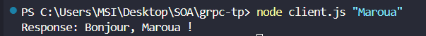
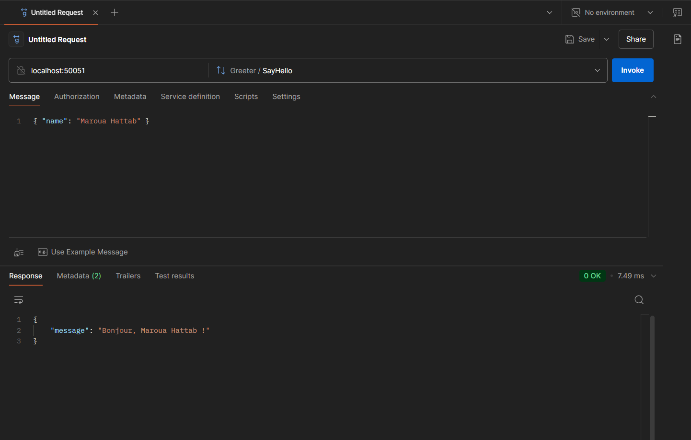

# 🚀 Projet de Tutoriel gRPC

Ce dépôt contient un exemple simple de gRPC démontrant comment créer un service gRPC basique en Node.js.

## 📋 Aperçu

Ce projet implémente :
- Un serveur gRPC qui fournit un service de salutation
- Des définitions Protocol Buffer pour le service
- Un client simple pour les tests (optionnel)
- Une interface de proxy inverse (expliquée dans la section détaillée)

## 🔍 Comprendre le Projet

### Qu'est-ce que gRPC ?
gRPC est un framework RPC (Remote Procedure Call) universel haute performance, open-source, développé par Google. Il utilise HTTP/2 pour le transport et Protocol Buffers comme langage de description d'interface.

Avantages clés de gRPC :
- ⚡ Haute performance et efficacité
- 🔄 Streaming bidirectionnel
- 🌐 Indépendant du langage et de la plateforme
- 📦 Sérialisation de messages compacte

### Qu'est-ce que Protocol Buffers ?
Protocol Buffers (protobuf) est une méthode de sérialisation de données structurées qui est :
- 🧩 Plus compacte que JSON ou XML
- 🔧 Fortement typée
- ⚡ Plus rapide à sérialiser/désérialiser
- 📚 Supporte l'évolution du schéma

## 🛠️ Prérequis

- Node.js (v12 ou plus récent)
- Compilateur Protocol Buffers (protobuf)

### Instructions d'installation

**Pour Ubuntu :**
```bash
# Installer protobuf
sudo snap install protobuf --classic

# Installer Node.js
sudo snap install node --classic
```

**Pour les autres plateformes :**
- Protobuf : Télécharger depuis [le site officiel](https://protobuf.dev/downloads/)
- Node.js : Télécharger depuis [le site officiel](https://nodejs.org/en/download)

## 🚀 Configuration du Projet

1. Créer un nouveau répertoire et y accéder :
```bash
mkdir grpc-tp
cd grpc-tp
```

2. Initialiser le projet Node.js :
```bash
npm init -y
```

3. Installer les dépendances requises :
```bash
npm install @grpc/grpc-js @grpc/proto-loader
```

## 📂 Structure du Projet

```
grpc-tp/
├── hello.proto    # Définition Protocol Buffer
├── server.js      # Implémentation du serveur gRPC
├── client.js      # (Optionnel) Client gRPC pour les tests
├── package.json   # Configuration du projet Node.js
└── img/           # Répertoire contenant les images de test Postman
    └── postman.png
```

## 📝 Étapes d'Implémentation Détaillées

### Étape 1 : Créer la Définition Protocol Buffer

Créer un fichier nommé `hello.proto` avec le contenu suivant :

```protobuf
syntax = "proto3";
package hello;

service Greeter {
  rpc SayHello (HelloRequest) returns (HelloReply) {}
}

message HelloRequest {
  string name = 1;
}

message HelloReply {
  string message = 1;
}
```

**Explication :**
- `syntax = "proto3"` : Spécifie que nous utilisons Protocol Buffers version 3
- `package hello` : Définit l'espace de noms pour notre service
- `service Greeter` : Définit un service avec une méthode (`SayHello`)
- `message HelloRequest` et `message HelloReply` : Définissent la structure de nos objets de requête et de réponse
- Les nombres (comme `string name = 1;`) sont des identificateurs de champ utilisés dans l'encodage binaire

### Étape 2 : Implémenter le Serveur gRPC

Créer un fichier nommé `server.js` avec le contenu suivant :

```javascript
const grpc = require('@grpc/grpc-js');
const protoLoader = require('@grpc/proto-loader');
const path = require('path');

// Charger la définition protobuf
const PROTO_PATH = path.join(__dirname, 'hello.proto');
const packageDefinition = protoLoader.loadSync(PROTO_PATH, {
  keepCase: true,
  longs: String,
  enums: String,
  defaults: true,
  oneofs: true
});

// Charger le package et obtenir notre définition de service
const helloProto = grpc.loadPackageDefinition(packageDefinition).hello;

// Implémenter la méthode SayHello
function sayHello(call, callback) {
  // Extraire le nom de la requête
  const { name } = call.request;
  
  // Créer la réponse
  const reply = { message: `Bonjour, ${name} !` };
  
  // Renvoyer la réponse
  callback(null, reply);
}

function main() {
  // Créer un nouveau serveur gRPC
  const server = new grpc.Server();
  
  // Ajouter notre implémentation de service au serveur
  server.addService(helloProto.Greeter.service, {
    SayHello: sayHello
  });
  
  // Définir l'adresse d'écoute
  const port = '0.0.0.0:50051';
  
  // Démarrer le serveur
  server.bindAsync(port, grpc.ServerCredentials.createInsecure(), () => {
    console.log(`Serveur gRPC démarré sur ${port}`);
  });
}

main();
```

**Explication :**
1. **Chargement de la Définition Proto** :
   - Nous utilisons `protoLoader.loadSync` pour analyser notre fichier `.proto`
   - L'objet options configure la façon dont le proto est interprété
   
2. **Implémentation du Service** :
   - La fonction `sayHello` implémente notre méthode de service
   - Elle prend deux paramètres :
     - `call` : Contient la requête et les métadonnées
     - `callback` : Fonction à appeler avec notre réponse
   
3. **Création du Serveur** :
   - Nous créons un nouveau serveur gRPC
   - Ajoutons notre implémentation de service
   - Utilisons `bindAsync` pour commencer à écouter sur toutes les interfaces (0.0.0.0) sur le port 50051
   - Nous utilisons des identifiants non sécurisés (pas de chiffrement) pour plus de simplicité

### Étape 3 (Optionnelle) : Implémenter un Client Simple

Créer un fichier nommé `client.js` avec le contenu suivant :

```javascript
const grpc = require('@grpc/grpc-js');
const protoLoader = require('@grpc/proto-loader');
const path = require('path');

// Charger la définition protobuf
const PROTO_PATH = path.join(__dirname, 'hello.proto');
const packageDefinition = protoLoader.loadSync(PROTO_PATH, {
  keepCase: true,
  longs: String,
  enums: String,
  defaults: true,
  oneofs: true
});

// Charger le package et créer un client
const helloProto = grpc.loadPackageDefinition(packageDefinition).hello;
const client = new helloProto.Greeter(
  'localhost:50051',
  grpc.credentials.createInsecure()
);

// Obtenir le nom des arguments de ligne de commande ou utiliser "World" par défaut
const name = process.argv[2] || 'World';

// Appeler la méthode SayHello
client.sayHello({ name: name }, (err, response) => {
  if (err) {
    console.error('Erreur:', err);
    return;
  }
  console.log('Réponse:', response.message);
});
```

**Explication :**
1. **Création du Client** :
   - Nous chargeons la même définition proto
   - Créons un client connecté à notre serveur sur `localhost:50051`
   
2. **Faire l'Appel RPC** :
   - Nous appelons la méthode `sayHello` avec un objet de requête
   - Gérons la réponse dans une fonction de rappel

## 🏃‍♂️ Exécution de l'Application

1. Démarrer le serveur :
```bash
node server.js
```

2. Le serveur sera disponible à `localhost:50051`

3. Si vous avez créé le client, testez-le :
```bash
node client.js "Votre Nom"
```



## 🧪 Test avec Postman

1. Créer une nouvelle requête gRPC dans Postman
2. Définir l'adresse du serveur sur `localhost:50051`
3. Importer le fichier `hello.proto`
4. Sélectionner le service `Greeter` et la méthode `SayHello`
5. Envoyer une requête avec le corps JSON : `{ "name": "TestUser" }`

### Résultats du Test Postman



## 📝 Conclusion
Dans ce tutoriel, nous avons exploré comment créer un service gRPC en JavaScript. Nous avons utilisé le protocole Protobuf pour définir notre service et gRPC pour la communication. Nous avons également vu comment implémenter un client simple pour tester notre service.

## 📚 Ressources Supplémentaires
- [Documentation officielle de gRPC](https://grpc.io/docs/)
- [Documentation de Protocol Buffers](https://developers.google.com/protocol-buffers/docs/overview)
- [Exemple de client gRPC en JavaScript](https://github.com/grpc/grpc-node/tree/master/examples/helloworld)
