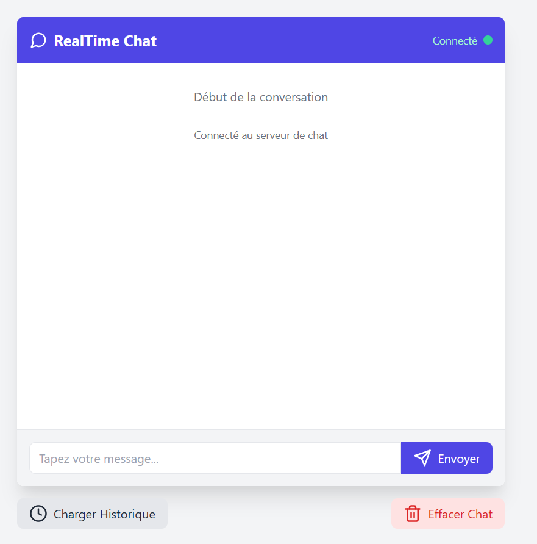
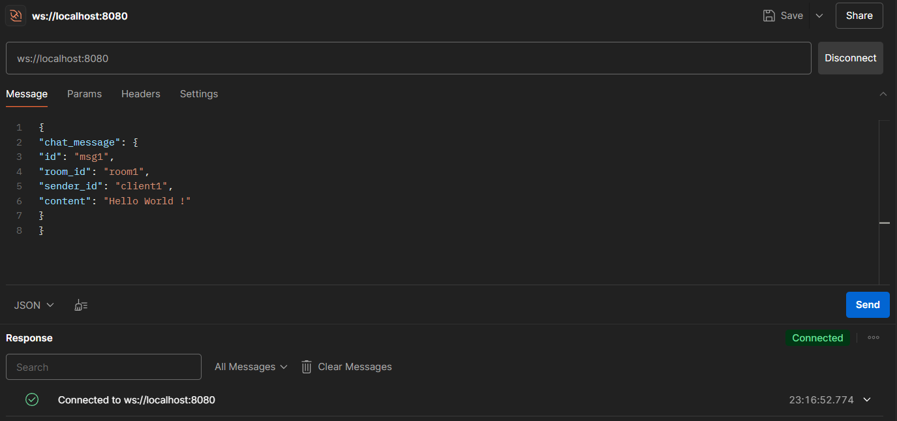
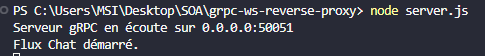

# 💬 Service de Chat gRPC avec Reverse Proxy WebSocket 🚀

## 📝 Présentation du Projet
Ce projet implémente un service de chat simplifié utilisant gRPC avec un reverse proxy WebSocket pour relayer les messages. L'objectif est de se familiariser avec la définition d'un service gRPC, la création d'un serveur en Node.js et la mise en place d'un reverse proxy WebSocket.

## 🏗️ Composants du Système
- **🖥️ Serveur gRPC** : Gère les messages de chat et les informations utilisateur
- **🔄 Proxy WebSocket** : Fait le lien entre les clients web et le serveur gRPC
- **💻 Client Web** : Interface utilisateur pour interagir avec le système de chat

## 📌 Prérequis
- 🟢 Node.js (v14.x ou supérieur)
- 📦 npm (v6.x ou supérieur)

## ⚙️ Installation

### 1️⃣ Créer et accéder au répertoire du projet
```bash
mkdir grpc-ws-reverse-proxy
cd grpc-ws-reverse-proxy
npm init -y
```

### 2️⃣ Installer les dépendances
```bash
npm install @grpc/grpc-js @grpc/proto-loader ws
```

## 📂 Structure du Projet
```
grpc-ws-reverse-proxy/
├── 📜 chat.proto         # Définition du service avec Protocol Buffers
├── 🖥️ server.js          # Implémentation du serveur gRPC
├── 🔄 proxy.js           # Reverse proxy WebSocket
├── 🌐 client.html        # Interface web
└── 📖 README.md          # Ce fichier
└── 📁img
    └── 📜 console.png    
    └── 📜 interface-client.png
    └── 📜 tests-postman.png
```

## 📄 Fichiers du Projet

### 📜 1. Définition du Service (chat.proto)
Le fichier définit :
- 📌 L'énumération `UserStatus` (UNKNOWN, ACTIVE, INACTIVE)
- 👤 Le message `User` (id, name, email, status)
- 💬 Le message `ChatMessage` (id, room_id, sender_id, content)
- ⚡ Le service `ChatService` avec les méthodes gRPC

### 🖥️ 2. Serveur gRPC (server.js)
Implémente :
- `GetUser` : Retourne un utilisateur fictif basé sur un objet admin
- `Chat` : Gère un streaming bidirectionnel des messages
- `GetChatHistory` : Récupère l'historique des messages (fonctionnalité ajoutée)

### 🔄 3. Reverse Proxy WebSocket (proxy.js)
- Expose un serveur WebSocket sur le port 8080
- Crée un stream gRPC pour chaque connexion WebSocket
- Relaie les messages entre les clients WebSocket et le serveur gRPC

### 🌐 4. Client Web (client.html)
- Interface de chat simple permettant d'envoyer et recevoir des messages
- Gestion de la connexion WebSocket
- Affichage des messages en temps réel

## 🚀 Démarrage du Projet

### ▶️ 1. Lancer le serveur gRPC
```bash
node server.js
```
📡 Le serveur écoute sur `0.0.0.0:50051`.

### ▶️ 2. Lancer le reverse proxy WebSocket
```bash
node proxy.js
```
🌍 Le proxy est disponible sur `ws://localhost:8080`.

### 🌐 3. Ouvrir le client web
Ouvrez le fichier `client.html` dans un navigateur pour accéder à l'interface de chat.

## 🛠️ Tests avec Postman

1️⃣ Ouvrez Postman et créez une nouvelle requête WebSocket
2️⃣ Connectez-vous à l'URL `ws://localhost:8080`
3️⃣ Envoyez un message JSON au format suivant :

```json
{
  "chat_message": {
    "id": "msg1",
    "room_id": "room1",
    "sender_id": "client1",
    "content": "Bonjour le monde !"
  }
}
```

4️⃣ Vous devriez recevoir une réponse du serveur avec un horodatage ⏳

## ✅ Fonctionnalités Implémentées

### 🔹 Fonctionnalités de Base
- 👤 Récupération des informations utilisateur via gRPC
- 🔄 Streaming bidirectionnel des messages de chat
- 🌐 Relais des messages WebSocket vers gRPC

### 🔹 Fonctionnalités Étendues
- 📜 Stockage et récupération de l'historique des messages
- 🌍 Client web simple pour les messages en temps réel

## 📸 Captures d'écran

### 🖥️ Interface Client Web


### 🛠️ Tests avec Postman





## 🔧 Travail Réalisé

### 📜 1. Fonction d'Historique des Messages
- Ajout de la méthode `GetChatHistory` dans le service gRPC
- 📂 Stockage des messages dans un tableau en mémoire sur le serveur
- 🖥️ Ajout d'éléments d'interface pour récupérer et afficher l'historique

### 🌐 2. Client Web Simple
- 🏗️ Développement d'une page HTML avec JavaScript
- 🔄 Connexion au serveur WebSocket
- 💬 Envoi et réception des messages en temps réel
- 🎨 Interface utilisateur intuitive avec mise en forme appropriée


