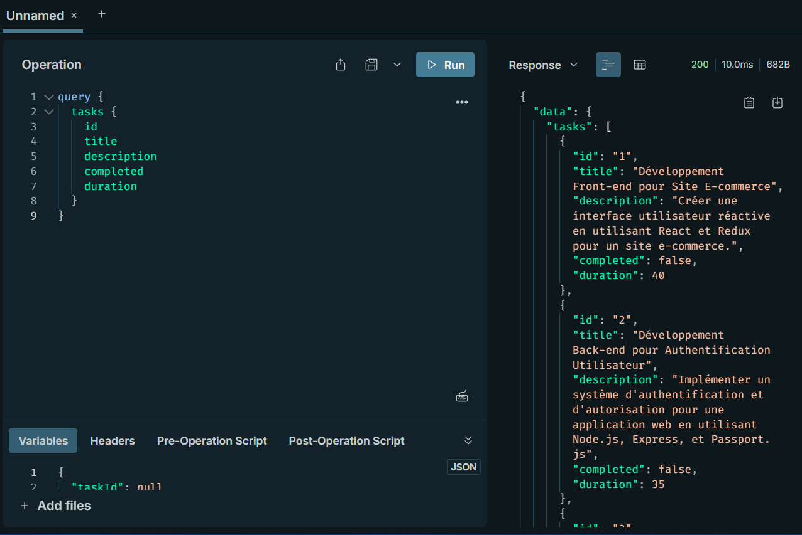
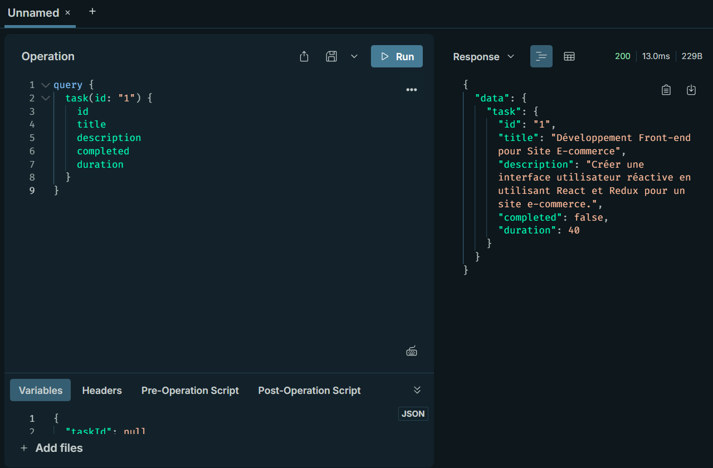
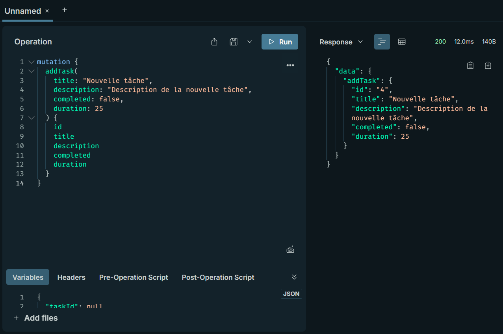
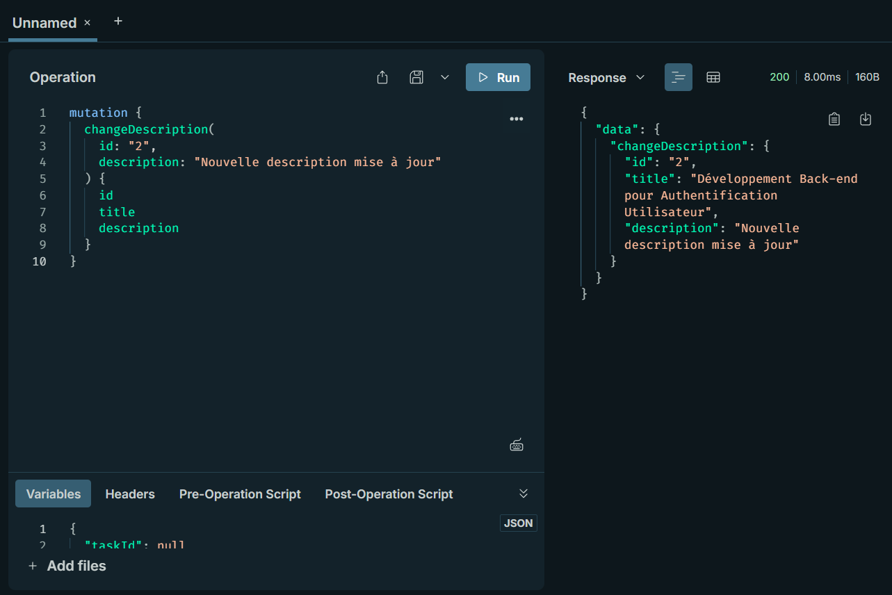
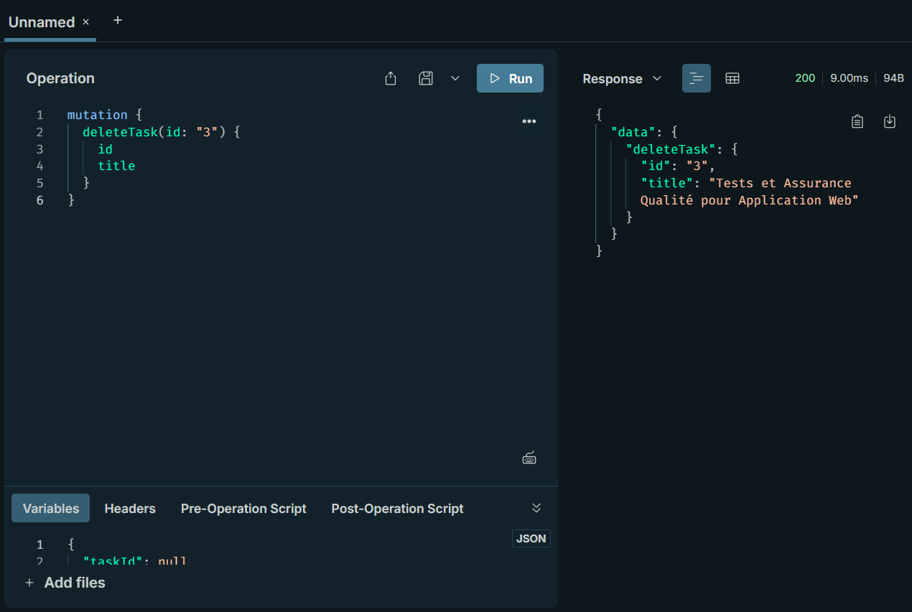

# 🚀 TP GraphQL - Système de Gestion de Tâches

## 🎯 Objectifs
- Comprendre comment configurer et utiliser GraphQL avec Node.js et Express
- Apprendre à créer un schéma GraphQL et des résolveurs pour gérer les requêtes et les mutations
- Développer une API simple de gestion de tâches

## 🛠️ Outils Utilisés
- Node.js
- GraphQL
- Express
- Apollo Server

## ✅ Prérequis
- Node.js installé sur votre machine
  - Sur Ubuntu: `sudo snap install node --classic`
  - Sur d'autres systèmes: [téléchargez Node.js](https://nodejs.org/en/download)

## 📥 Installation

1. Clonez ce dépôt ou créez un nouveau répertoire:
```bash
mkdir tp-graphql
cd tp-graphql
npm init -y
```

2. Installez les dépendances nécessaires:
```bash
npm install express @apollo/server body-parser @graphql-tools/schema graphql
```

3. Créez les fichiers nécessaires:
   - `taskSchema.gql`: Définit le schéma GraphQL
   - `taskSchema.js`: Charge le schéma depuis le fichier .gql
   - `taskResolver.js`: Implémente les résolveurs pour les requêtes et mutations
   - `index.js`: Configure le serveur Express et Apollo

## 📁 Structure du Projet

### 📝 Schéma GraphQL (`taskSchema.gql`)
```graphql
type Task {
  id: ID!
  title: String!
  description: String!
  completed: Boolean!
  duration: Int!
}

type Query {
  task(id: ID!): Task
  tasks: [Task]
}

type Mutation {
  addTask(title: String!, description: String!, completed: Boolean!, duration: Int!): Task
  completeTask(id: ID!): Task
  changeDescription(id: ID!, description: String!): Task
  deleteTask(id: ID!): Task
}
```

### 🔄 Chargeur de Schéma (`taskSchema.js`)
Ce fichier charge le schéma GraphQL depuis `taskSchema.gql` et le convertit en un objet utilisable par Apollo Server.

### ⚙️ Résolveurs (`taskResolver.js`)
Implémente la logique métier pour:
- Récupérer une tâche spécifique ou toutes les tâches
- Ajouter une nouvelle tâche
- Marquer une tâche comme terminée
- Modifier la description d'une tâche
- Supprimer une tâche

### 🖥️ Serveur (`index.js`)
Configure et démarre le serveur Express avec Apollo Server pour gérer les requêtes GraphQL.

## 🚦 Utilisation

1. Démarrez le serveur:
```bash
node index.js
```

2. Accédez à l'interface GraphQL:
```
http://localhost:5000/graphql
```

3. Exemples de requêtes à tester dans Apollo Studio Sandbox:

### 📋 Récupérer toutes les tâches
```graphql
query {
  tasks {
    id
    title
    description
    completed
    duration
  }
}
```




### 🔍 Récupérer une tâche spécifique
```graphql
query {
  task(id: "1") {
    id
    title
    description
    completed
    duration
  }
}
```





### ➕ Ajouter une nouvelle tâche
```graphql
mutation {
  addTask(
    title: "Nouvelle tâche",
    description: "Description de la nouvelle tâche",
    completed: false,
    duration: 25
  ) {
    id
    title
    description
    completed
    duration
  }
}
```





### ✓ Marquer une tâche comme terminée
```graphql
mutation {
  completeTask(id: "1") {
    id
    title
    completed
  }
}
```


### 📝 Modifier la description d'une tâche
```graphql
mutation {
  changeDescription(
    id: "2", 
    description: "Nouvelle description mise à jour"
  ) {
    id
    title
    description
  }
}
```




### 🗑️ Supprimer une tâche
```graphql
mutation {
  deleteTask(id: "3") {
    id
    title
  }
}
```





## 🔄 Modifications Effectuées

1. Ajout du champ `duration` au type `Task`
2. Mise à jour du résolveur `addTask` pour prendre en compte le nouveau champ
3. Ajout de la mutation `changeDescription` pour modifier la description d'une tâche
4. Ajout de la mutation `deleteTask` pour supprimer une tâche

## 📚 Ressources Utiles
- [Documentation officielle de GraphQL](https://graphql.org/learn/) 📖
- [Documentation Apollo Server](https://www.apollographql.com/docs/apollo-server/) 🚀
- [Documentation Express](https://expressjs.com/) 🌐