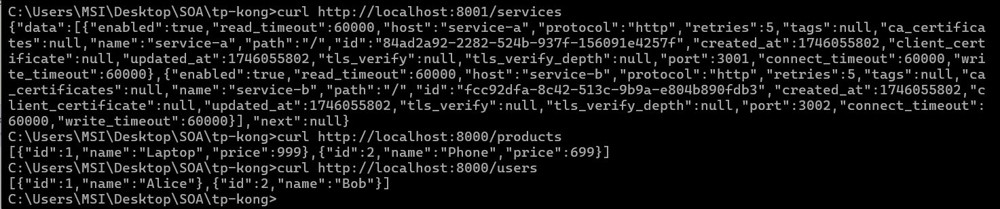

# 🚀 TP8 : Microservices avec API Gateway Dynamique

## 📝 Description du projet
Ce projet démontre la mise en place d'une architecture de microservices utilisant Kong comme API Gateway dynamique en mode DB-less. Il comprend deux microservices REST développés en Node.js :
- **Service A (Users)** : Fournit des informations sur les utilisateurs
- **Service B (Products)** : Fournit des informations sur les produits

## 📂 Structure du projet
```
tp-kong/
|-- service-a/
|   |-- Dockerfile
|   |-- package.json
|   |-- index.js
|-- service-b/
|   |-- Dockerfile
|   |-- package.json
|   |-- index.js
|-- kong.yml
|-- docker-compose.yml
|-- README.md
```

## 🧩 Composants du projet

### 🔌 Microservices
1. **Service A (Users)** 👤
   - Port: 3001
   - Endpoint: `/users`
   - Retourne une liste d'utilisateurs au format JSON

2. **Service B (Products)** 🛒
   - Port: 3002
   - Endpoint: `/products`
   - Retourne une liste de produits au format JSON

### 🌉 Kong API Gateway
- Kong est configuré en mode DB-less via un fichier de configuration déclaratif
- Routes les requêtes vers les microservices appropriés:
  - `/users` -> Service A
  - `/products` -> Service B

## 📄 Fichiers importants

### service-a/index.js
```javascript
const express = require('express');
const app = express();
const PORT = 3001;
const users = [ { id: 1, name: 'Alice' }, { id: 2, name: 'Bob' } ];

app.get('/', (req, res) => res.json(users));

app.listen(PORT, () => console.log(`Service A running on port ${PORT}`));
```

### service-b/index.js
```javascript
const express = require('express');
const app = express();
const PORT = 3002;
const products = [ { id: 1, name: 'Laptop', price: 999 }, { id: 2, name: 'Phone', price: 699 } ];

app.get('/', (req, res) => res.json(products));

app.listen(PORT, () => console.log(`Service B running on port ${PORT}`));
```

### Dockerfile (pour les deux services)
```dockerfile
FROM node:22-alpine
WORKDIR /app
COPY package*.json ./
RUN npm install --production
COPY index.js ./
EXPOSE 3001  # 3002 pour service-b
CMD ["node", "index.js"]
```

### kong.yml
```yaml
_format_version: "1.1"
services:
  - name: service-a
    url: http://service-a:3001
    routes:
      - name: users-route
        paths: ["/users"]
  - name: service-b
    url: http://service-b:3002
    routes:
      - name: products-route
        paths: ["/products"]
```

### docker-compose.yml
```yaml
services:
  service-a:
    build: ./service-a
    networks:
      - kong-net

  service-b:
    build: ./service-b
    networks:
      - kong-net

  kong:
    image: kong:latest
    environment:
      KONG_DATABASE: "off"
      KONG_DECLARATIVE_CONFIG: /etc/kong/kong.yml
    volumes:
      - ./kong.yml:/etc/kong/kong.yml:ro
    ports:
      - "8000:8000" # Proxy
      - "8001:8001" # Admin API
    networks:
      - kong-net

networks:
  kong-net:
    driver: bridge
```

## 🚀 Instructions de déploiement

1. **Lancer les conteneurs** 🐳
   ```bash
   docker compose up -d --build
   ```

2. **Vérifier l'état des services** 🔍
   ```bash
   docker compose ps
   ```

3. **Tester les endpoints via curl** 🌐
   ```bash
   curl http://localhost:8000/users
   curl http://localhost:8000/products
   ```

## ✅ Résultats des tests

Voici le résultat des tests effectués avec curl :



## ⚙️ Mode de fonctionnement

1. 📱 Les requêtes client arrivent sur Kong (port 8000)
2. 🧭 Kong route ces requêtes vers le microservice approprié en fonction du chemin
3. 🔄 Les microservices traitent les requêtes et renvoient les résultats
4. 📤 Kong transmet ces résultats au client

## 🗄️ Kong en mode DB-less

Kong est configuré en mode DB-less, ce qui signifie :
- 🔌 Pas de dépendance à une base de données externe
- 📝 Configuration via un fichier déclaratif (kong.yml)
- 🚀 Plus simple à déployer et à mettre à l'échelle
- 💻 Idéal pour les environnements de développement et les petits déploiements

## 🏁 Conclusion

Ce projet démontre comment Kong peut être utilisé comme API Gateway pour simplifier la gestion des microservices. Les principaux avantages incluent :
- 🧭 Routage centralisé
- 🧩 Séparation claire des préoccupations entre les services
- 🐳 Facilité de déploiement avec Docker Compose
- ⚙️ Configuration déclarative simple